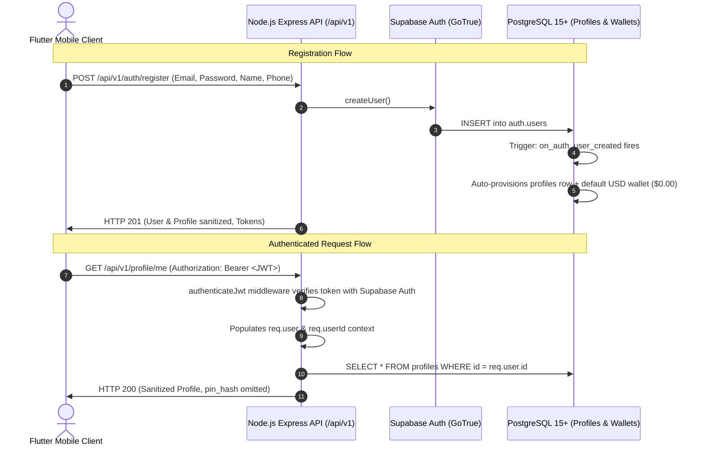

# Authentication & Authorization Architecture (Sprint 2)

**Version:** 1.0.0  
**Status:** Implemented & Verified  
**Component:** B-Wallet Authentication, Identity & Protected API Subsystem  

---

## 1. Architectural Strategy: Hybrid Authority

B-Wallet leverages **Supabase Auth** as the primary identity provider for account creation, credential hashing, and JWT token issuance, paired with **Node.js Express** as the financial business logic controller and security enforcement gateway.



---

## 2. Protected API Middleware (`authenticateJwt`)

Located at `src/middlewares/auth.js`:

1. **Header Extraction:** Reads `Authorization: Bearer <token>`.
2. **Rejection Handling:**
   - Missing header $\rightarrow$ `HTTP 401 (AUTH_HEADER_MISSING)`
   - Non-Bearer scheme $\rightarrow$ `HTTP 401 (AUTH_HEADER_MALFORMED)`
   - Empty token $\rightarrow$ `HTTP 401 (TOKEN_EMPTY)`
   - Expired or tampered token $\rightarrow$ `HTTP 401 (TOKEN_INVALID)`
3. **Context Injection:**
   Downstream route handlers access:
   ```javascript
   req.user = {
     id: '...',           // User UUID
     email: '...',        // User email
     phone: '...',        // Phone number (if set)
     user_metadata: {},   // Names, preferences
     role: 'authenticated'
   };
   req.userId = '...';    // Direct UUID shortcut
   ```
4. **Security Principle:** Downstream business logic **NEVER** relies on client-supplied user IDs in request bodies or query parameters. The authenticated JWT's `req.user.id` is the single source of identity truth.

---

## 3. Password Recovery & OTP Lifecycle

The SRS specifies strict temporal and attempt constraints on one-time passwords:

| Requirement | Specification | Enforcement Mechanism |
|---|---|---|
| **OTP Cooldown** (`FR-AUTH-003`) | 60 seconds | `AuthService.requestPasswordRecovery` tracks timestamps; rejects re-requests within 60s with HTTP 400 (`OTP_COOLDOWN`) and exact `retryAfterSeconds`. |
| **OTP Validity** (`FR-AUTH-004`) | 5 minutes ($300,000$ms) | Reject verification if timestamp exceeds 5 minutes (`OTP_EXPIRED`). |
| **Attempt Invalidation** (`FR-AUTH-004`) | 3 failed attempts | Session counter increments per failure; on 3rd failure, the session is invalidated (`OTP_MAX_ATTEMPTS_EXCEEDED`). |

---

## 4. API Endpoints Catalog

### Authentication Endpoints
* `POST /api/v1/auth/register`: Public. Validates strong password rules, registers account, auto-provisions wallet ($0.00).
* `POST /api/v1/auth/login`: Public. Authenticates email/password, returns access token, refresh token, and sanitized profile.
* `POST /api/v1/auth/refresh`: Public. Exchanges refresh token for new access token.
* `POST /api/v1/auth/logout`: Protected. Revokes active session.
* `POST /api/v1/auth/password-recovery/request`: Public. Requests recovery OTP with 60-second cooldown.
* `POST /api/v1/auth/password-recovery/verify-otp`: Public. Verifies 6-digit OTP code (max 3 attempts, 5-min window).
* `POST /api/v1/auth/password-recovery/reset`: Protected (via recovery token). Sets new password.

### Transaction PIN Endpoints
* `GET /api/v1/auth/pin/status`: Protected. Inquires if PIN is configured, lockout status, and remaining attempts.
* `POST /api/v1/auth/pin/setup`: Protected. Sets initial 6-digit PIN with Argon2id.
* `POST /api/v1/auth/pin/verify`: Protected. Verifies PIN, updates attempt count, locks for 15 mins on 3 failures, issues 5-min transaction ticket on success.
* `POST /api/v1/auth/pin/change`: Protected. Validates current PIN and updates to new 6-digit PIN.

### Profile Endpoints
* `GET /api/v1/profile/me`: Protected. Returns sanitized personal profile.
* `PATCH /api/v1/profile/me`: Protected. Updates names, phone, date of birth, avatar URL.
