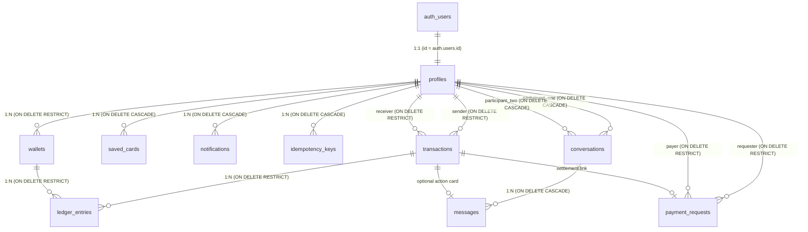

# B-Wallet Database Schema Documentation (Sprint 1)

**Version:** 1.0.0  
**Database:** PostgreSQL 15+ (Hosted on Supabase)  
**Target Application:** B-Wallet Digital FinTech E-Wallet  

---

## 1. Architectural Overview & Design Principles

The B-Wallet database is engineered around high-assurance financial integrity, immutable ledger auditing, and strict security boundaries:

1. **Fixed-Point Precision (`NUMERIC(15,2)`):** All monetary balances, transaction amounts, and fees use fixed-point arithmetic (`NUMERIC(15,2)`) to eliminate floating-point rounding errors.
2. **Double-Entry Bookkeeping:** Every financial movement creates immutable, offsetting debit and credit records in `public.ledger_entries` that balance to zero net sum.
3. **Immutable Financial History:** The `public.transactions` table is strictly append-only. No updates or deletions are permitted on settled transactions; reversals and refunds are recorded as new compensating transactions (`NFR-INT-004`).
4. **Non-Negative Balance Invariant:** The database enforces `CHECK (balance >= 0.00)` at the column level on `public.wallets`, guaranteeing overdrafts cannot occur regardless of application logic bugs.
5. **Idempotent Operations:** Client-generated UUIDv4 idempotency keys are enforced via unique constraints on `public.transactions` and tracked with payload hashing in `public.idempotency_keys` (`NFR-INT-002`).
6. **Automated User Provisioning:** A PostgreSQL `SECURITY DEFINER` trigger (`public.handle_new_user()`) hooks into Supabase `auth.users` to automatically provision a 1:1 `profiles` record and an active default USD wallet ($0.00).
7. **Defense-in-Depth Row Level Security (RLS):** All public tables have RLS enabled. Direct client mutation of financial tables (`wallets`, `transactions`, `ledger_entries`) is entirely blocked; mutations occur exclusively through backend service role execution.

---

## 2. Entity-Relationship (ER) Diagram

---

## 3. Database Extensions & Custom Enums

### Extensions
* `uuid-ossp`: For generating UUIDv4 primary keys.
* `pgcrypto`: For cryptographic primitives and random token generation.

### Enumerated Types

#### `transaction_type`
Represents the business classification of a financial event:
* `TOP_UP`: External funding into wallet.
* `TRANSFER`: Peer-to-peer (P2P) fund transfer.
* `REQUEST`: Settlement of a payment request.
* `BILL_PAYMENT`: Outflow to utility or merchant billing service.

#### `transaction_status`
Lifecycle states of a transaction:
* `PENDING`: Transaction created, awaiting settlement or authorization.
* `COMPLETED`: Successfully settled and balanced in ledger.
* `FAILED`: Transaction aborted or rejected.
* `REVERSED`: Compensating reversal applied after completion.

#### `entry_direction`
Double-entry accounting direction:
* `DEBIT`: Money exiting a wallet (outflow).
* `CREDIT`: Money entering a wallet (inflow).

#### `notification_category`
Categories for in-app notification center:
* `TRANSACTIONS`: Alerts regarding credits, debits, and requests.
* `PROMOS`: Marketing promotions and reward updates.
* `SYSTEM`: Security alerts and system health notifications.

---

## 4. Complete Table Dictionary

### 4.1. `public.profiles`
Extends `auth.users` with user metadata and Argon2id transaction PIN protection.

| Column | Type | Nullable | Default | Description |
|---|---|---|---|---|
| `id` | `UUID` | NO | - | Primary Key, references `auth.users(id)` ON DELETE CASCADE |
| `first_name` | `VARCHAR(100)` | YES | NULL | User first name |
| `last_name` | `VARCHAR(100)` | YES | NULL | User last name |
| `phone_number` | `VARCHAR(20)` | YES | NULL | Phone number (indexed) |
| `email` | `VARCHAR(255)` | YES | NULL | Email address (indexed) |
| `date_of_birth` | `DATE` | YES | NULL | Date of birth for KYC verification |
| `avatar_url` | `TEXT` | YES | NULL | Supabase Storage URL for profile picture |
| `pin_hash` | `TEXT` | YES | NULL | Argon2id hash of 6-digit transaction PIN |
| `pin_failed_attempts`| `INTEGER` | NO | 0 | Failed PIN counter (resets on success) |
| `pin_locked_until` | `TIMESTAMPTZ` | YES | NULL | 15-minute lock expiration after 3 failures |
| `is_verified` | `BOOLEAN` | NO | FALSE | Identity verification status |
| `created_at` | `TIMESTAMPTZ` | NO | `NOW()` | Record creation timestamp |
| `updated_at` | `TIMESTAMPTZ` | NO | `NOW()` | Auto-updated via trigger |

**Indexes:**
* `idx_profiles_phone_number` on `phone_number` (partial, where not null)
* `idx_profiles_email` on `email` (partial, where not null)

---

### 4.2. `public.wallets`
Stores spendable balances per user per currency.

| Column | Type | Nullable | Default | Description |
|---|---|---|---|---|
| `id` | `UUID` | NO | `uuid_generate_v4()` | Primary Key |
| `user_id` | `UUID` | NO | - | References `public.profiles(id)` ON DELETE RESTRICT |
| `currency` | `CHAR(3)` | NO | `'USD'` | ISO 4217 Currency code |
| `balance` | `NUMERIC(15,2)` | NO | `0.00` | Spendable balance |
| `status` | `VARCHAR(10)` | NO | `'ACTIVE'` | `'ACTIVE'`, `'FROZEN'`, `'CLOSED'` |
| `created_at` | `TIMESTAMPTZ` | NO | `NOW()` | Creation timestamp |
| `updated_at` | `TIMESTAMPTZ` | NO | `NOW()` | Auto-updated via trigger |

**Constraints:**
* `chk_wallets_balance_non_negative`: `CHECK (balance >= 0.00)`
* `uq_wallets_user_currency`: `UNIQUE (user_id, currency)`
* `chk_wallets_currency_length`: `CHECK (char_length(currency) = 3)`

**Indexes:**
* `idx_wallets_user_id` on `user_id`

---

### 4.3. `public.transactions`
Immutable headers for all financial events.

| Column | Type | Nullable | Default | Description |
|---|---|---|---|---|
| `id` | `UUID` | NO | `uuid_generate_v4()` | Primary Key |
| `transaction_reference` | `VARCHAR(50)` | NO | - | Human-readable unique reference (e.g. `TXN-...`) |
| `sender_id` | `UUID` | YES | NULL | References `public.profiles(id)` ON DELETE RESTRICT |
| `receiver_id` | `UUID` | YES | NULL | References `public.profiles(id)` ON DELETE RESTRICT |
| `amount` | `NUMERIC(15,2)` | NO | - | Transaction principal amount |
| `fee` | `NUMERIC(15,2)` | NO | `0.00` | Transaction fee charged |
| `currency` | `CHAR(3)` | NO | `'USD'` | ISO 4217 Currency code |
| `type` | `transaction_type` | NO | - | Event type (`TOP_UP`, `TRANSFER`, etc.) |
| `status` | `transaction_status` | NO | `'PENDING'` | Lifecycle status (`PENDING`, `COMPLETED`, etc.) |
| `category` | `VARCHAR(50)` | YES | NULL | Category for analytics (Food, Bills, etc.) |
| `note` | `TEXT` | YES | NULL | User memo/note |
| `idempotency_key` | `UUID` | YES | NULL | Client-supplied UUIDv4 (unique constraint) |
| `created_at` | `TIMESTAMPTZ` | NO | `NOW()` | Initiation timestamp |
| `settled_at` | `TIMESTAMPTZ` | YES | NULL | Final settlement timestamp |

**Constraints:**
* `chk_transactions_amount_positive`: `CHECK (amount > 0)`
* `chk_transactions_fee_non_negative`: `CHECK (fee >= 0)`
* `chk_transactions_currency_length`: `CHECK (char_length(currency) = 3)`
* `uq_transactions_idempotency_key`: `UNIQUE (idempotency_key)`

**Indexes:**
* `idx_transactions_reference` on `transaction_reference`
* `idx_transactions_sender_id` on `sender_id`
* `idx_transactions_receiver_id` on `receiver_id`
* `idx_transactions_created_at` on `created_at DESC`
* `idx_transactions_idempotency_key` on `idempotency_key`

---

### 4.4. `public.ledger_entries`
Double-entry records representing the atomic debits and credits of settled transactions.

| Column | Type | Nullable | Default | Description |
|---|---|---|---|---|
| `id` | `UUID` | NO | `uuid_generate_v4()` | Primary Key |
| `transaction_id` | `UUID` | NO | - | References `public.transactions(id)` ON DELETE RESTRICT |
| `wallet_id` | `UUID` | NO | - | References `public.wallets(id)` ON DELETE RESTRICT |
| `direction` | `entry_direction` | NO | - | `DEBIT` (outflow) or `CREDIT` (inflow) |
| `amount` | `NUMERIC(15,2)` | NO | - | Entry amount |
| `created_at` | `TIMESTAMPTZ` | NO | `NOW()` | Timestamp |

**Constraints:**
* `chk_ledger_entries_amount_positive`: `CHECK (amount > 0)`

**Indexes:**
* `idx_ledger_entries_transaction_id` on `transaction_id`
* `idx_ledger_entries_wallet_id` on `wallet_id`

---

### 4.5. `public.saved_cards`
Tokenized card storage compliant with PCI-DSS Level 4. No PAN or CVC is ever stored.

| Column | Type | Nullable | Default | Description |
|---|---|---|---|---|
| `id` | `UUID` | NO | `uuid_generate_v4()` | Primary Key |
| `user_id` | `UUID` | NO | - | References `public.profiles(id)` ON DELETE CASCADE |
| `gateway_customer_id` | `VARCHAR(255)` | YES | NULL | Gateway customer ID |
| `gateway_payment_method_id` | `VARCHAR(255)` | NO | - | Gateway token/payment method ID |
| `brand` | `VARCHAR(20)` | NO | - | Visa, MasterCard, Amex, etc. |
| `last4` | `CHAR(4)` | NO | - | Last 4 digits |
| `expiry_month` | `INTEGER` | NO | - | 1 to 12 |
| `expiry_year` | `INTEGER` | NO | - | >= 2026 |
| `is_default` | `BOOLEAN` | NO | FALSE | Default payment card flag |
| `created_at` | `TIMESTAMPTZ` | NO | `NOW()` | Creation timestamp |

**Constraints:**
* `chk_saved_cards_expiry_month`: `CHECK (expiry_month BETWEEN 1 AND 12)`
* `chk_saved_cards_expiry_year`: `CHECK (expiry_year >= 2026)`
* Brand check constraint & last4 regex check (`^\d{4}$`)

**Indexes:**
* `idx_saved_cards_user_id` on `user_id`

---

### 4.6. `public.conversations`
Social chat session between two distinct users.

| Column | Type | Nullable | Default | Description |
|---|---|---|---|---|
| `id` | `UUID` | NO | `uuid_generate_v4()` | Primary Key |
| `participant_one` | `UUID` | NO | - | References `public.profiles(id)` ON DELETE CASCADE |
| `participant_two` | `UUID` | NO | - | References `public.profiles(id)` ON DELETE CASCADE |
| `last_message_text` | `TEXT` | YES | NULL | Denormalized preview text |
| `last_message_time` | `TIMESTAMPTZ` | YES | NULL | Denormalized timestamp |
| `created_at` | `TIMESTAMPTZ` | NO | `NOW()` | Creation timestamp |
| `updated_at` | `TIMESTAMPTZ` | NO | `NOW()` | Auto-updated timestamp |

**Constraints:**
* `chk_conversations_different_participants`: `CHECK (participant_one <> participant_two)`
* `uq_conversations_participants`: `UNIQUE (participant_one, participant_two)`

**Indexes:**
* `idx_conversations_participant_one` on `participant_one`
* `idx_conversations_participant_two` on `participant_two`

---

### 4.7. `public.messages`
Individual chat messages with optional embedded transaction reference.

| Column | Type | Nullable | Default | Description |
|---|---|---|---|---|
| `id` | `UUID` | NO | `uuid_generate_v4()` | Primary Key |
| `conversation_id` | `UUID` | NO | - | References `public.conversations(id)` ON DELETE CASCADE |
| `sender_id` | `UUID` | NO | - | References `public.profiles(id)` ON DELETE CASCADE |
| `content` | `TEXT` | NO | - | Message text |
| `is_read` | `BOOLEAN` | NO | FALSE | Read receipt status |
| `transaction_id` | `UUID` | YES | NULL | References `public.transactions(id)` ON DELETE SET NULL |
| `created_at` | `TIMESTAMPTZ` | NO | `NOW()` | Creation timestamp |

**Indexes:**
* `idx_messages_conversation_id` on `(conversation_id, created_at DESC)`
* `idx_messages_sender_id` on `sender_id`

---

### 4.8. `public.notifications`
Persistent in-app notification center storage (Decision 1).

| Column | Type | Nullable | Default | Description |
|---|---|---|---|---|
| `id` | `UUID` | NO | `uuid_generate_v4()` | Primary Key |
| `user_id` | `UUID` | NO | - | References `public.profiles(id)` ON DELETE CASCADE |
| `title` | `VARCHAR(255)` | NO | - | Notification title |
| `body` | `TEXT` | NO | - | Notification body message |
| `category` | `notification_category` | NO | `'SYSTEM'` | Category grouping |
| `is_read` | `BOOLEAN` | NO | FALSE | Mark-as-read indicator |
| `metadata` | `JSONB` | YES | `'{}'` | Flexible payload (deep link, transaction ID) |
| `created_at` | `TIMESTAMPTZ` | NO | `NOW()` | Creation timestamp |

**Indexes:**
* `idx_notifications_user_unread` on `(user_id, is_read, created_at DESC)`
* `idx_notifications_user_category` on `(user_id, category, created_at DESC)`

---

### 4.9. `public.payment_requests`
Pending invoice tickets separated from immutable transactions (Decision 2).

| Column | Type | Nullable | Default | Description |
|---|---|---|---|---|
| `id` | `UUID` | NO | `uuid_generate_v4()` | Primary Key |
| `requester_id` | `UUID` | NO | - | References `public.profiles(id)` ON DELETE RESTRICT |
| `payer_id` | `UUID` | NO | - | References `public.profiles(id)` ON DELETE RESTRICT |
| `amount` | `NUMERIC(15,2)` | NO | - | Requested amount |
| `currency` | `CHAR(3)` | NO | `'USD'` | Currency code |
| `category` | `VARCHAR(50)` | YES | NULL | Categorization for analytics |
| `note` | `TEXT` | YES | NULL | Request memo |
| `status` | `VARCHAR(20)` | NO | `'PENDING'` | `'PENDING'`, `'COMPLETED'`, `'DECLINED'`, `'CANCELLED'` |
| `transaction_id` | `UUID` | YES | NULL | Settlement link, references `public.transactions(id)` |
| `created_at` | `TIMESTAMPTZ` | NO | `NOW()` | Creation timestamp |
| `updated_at` | `TIMESTAMPTZ` | NO | `NOW()` | Auto-updated timestamp |

**Constraints:**
* `chk_payment_requests_amount_positive`: `CHECK (amount > 0)`
* `chk_payment_requests_currency_length`: `CHECK (char_length(currency) = 3)`
* `chk_payment_requests_different_users`: `CHECK (requester_id <> payer_id)`

**Indexes:**
* `idx_payment_requests_requester_id` on `requester_id`
* `idx_payment_requests_payer_id` on `payer_id`
* `idx_payment_requests_status` on `status`

---

### 4.10. `public.idempotency_keys`
API request deduplication and response caching table (Decision 3).

| Column | Type | Nullable | Default | Description |
|---|---|---|---|---|
| `id` | `UUID` | NO | `uuid_generate_v4()` | Primary Key |
| `key` | `UUID` | NO | - | Client-supplied idempotency key |
| `user_id` | `UUID` | NO | - | References `public.profiles(id)` ON DELETE CASCADE |
| `endpoint` | `VARCHAR(255)` | NO | - | Request API endpoint |
| `request_hash` | `VARCHAR(64)` | YES | NULL | SHA-256 payload hash |
| `response_status` | `INTEGER` | YES | NULL | HTTP status code cached |
| `response_body` | `JSONB` | YES | NULL | Cached JSON response body |
| `created_at` | `TIMESTAMPTZ` | NO | `NOW()` | Creation timestamp |
| `expires_at` | `TIMESTAMPTZ` | NO | `NOW() + 24h` | Expiration timestamp |

**Constraints:**
* `uq_idempotency_keys_key_user`: `UNIQUE (key, user_id)`

**Indexes:**
* `idx_idempotency_keys_lookup` on `(key, user_id)`
* `idx_idempotency_keys_expires_at` on `expires_at`

---

## 5. Triggers and Stored Functions

### `handle_new_user()`
* **Event:** `AFTER INSERT ON auth.users`
* **Security:** `SECURITY DEFINER` (executes with superuser/service_role permissions)
* **Search Path:** `public`
* **Behavior:**
  1. Creates a corresponding `public.profiles` row with ID = `NEW.id`, mapping email, phone, and metadata.
  2. Automatically creates a default `public.wallets` row (`currency = 'USD'`, `balance = 0.00`, `status = 'ACTIVE'`).

### `update_updated_at_column()`
* **Event:** `BEFORE UPDATE` on `profiles`, `wallets`, `conversations`, and `payment_requests`
* **Behavior:** Automatically updates `updated_at = NOW()`.

---

## 6. Row Level Security (RLS) Matrix

| Table | SELECT | INSERT | UPDATE | DELETE |
|---|---|---|---|---|
| `profiles` | Owner (`auth.uid() = id`) | Trigger only | Owner (`auth.uid() = id`) | Disabled |
| `wallets` | Owner (`auth.uid() = user_id`) | Service role only | Service role only | Disabled |
| `transactions` | Sender or Receiver | Service role only | Disabled (Immutable) | Disabled (Immutable) |
| `ledger_entries` | Wallet Owner | Service role only | Disabled (Immutable) | Disabled (Immutable) |
| `saved_cards` | Owner (`auth.uid() = user_id`) | Service role only | Disabled | Owner (`auth.uid() = user_id`) |
| `conversations` | Participants | Trigger/Service role | Service role | Disabled |
| `messages` | Conversation Participants | Conversation Participants | Disabled | Disabled |
| `notifications` | Owner (`auth.uid() = user_id`) | Service role only | Owner (`is_read` update) | Disabled |
| `payment_requests`| Requester or Payer | Requester | Requester or Payer | Requester (if PENDING) |
| `idempotency_keys`| Owner (`auth.uid() = user_id`) | Service role only | Service role only | Disabled |
