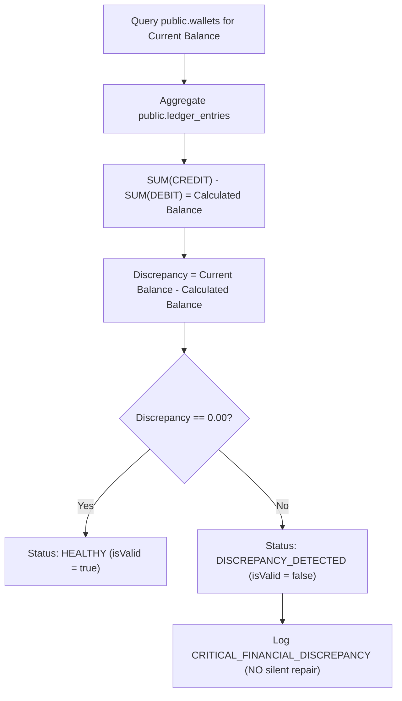

# Double-Entry Bookkeeping & Ledger Architecture

**Document Version:** 1.0.0  
**Project:** B-Wallet (FinTech Digital Wallet)  
**Classification:** Financial Core Architecture Specification  
**Compliance Standards:** OWASP FinTech Top 10, PCI-DSS Level 4, GAAP/IFRS Ledger Guidelines  

---

## 1. Executive Summary

B-Wallet's financial subsystem is designed as an **immutable, double-entry digital ledger**. 

In conventional consumer apps, wallet balances are often stored as mutable fields directly altered by application code (`balance = balance + amount`). In a FinTech system, this model is unacceptable due to the risk of race conditions, untraced funds, database corruption, or malicious tampering.

In B-Wallet:
1. **The Ledger is the Single Source of Truth:** A user's wallet balance is mathematically derived from the sum of its immutable ledger entries.
2. **Double-Entry Symmetry:** Every money movement generates balanced `DEBIT` and `CREDIT` entries ensuring that money cannot be created or destroyed.
3. **Strict Immutability:** Financial transaction records and ledger entries are **append-only**. `UPDATE` and `DELETE` operations are blocked at the database engine level via PostgreSQL Row Level Security (RLS) and lack of write policies for non-service roles.
4. **Real-Time Mathematical Auditability:** The stored procedure `verify_wallet_integrity(wallet_id)` enables instant, cryptographic auditing of any wallet at any time.

---

## 2. Core Double-Entry Principles

### 2.1 The Accounting Equation for Digital Wallets

In standard corporate accounting, Assets = Liabilities + Equity. In digital wallet systems, from the perspective of a user's wallet:

$$\text{Spendable Balance} = \sum(\text{CREDIT Entries}) - \sum(\text{DEBIT Entries})$$

* **`CREDIT` (Inflow):** Increases the user's spendable balance (e.g. Card Top-Up, Incoming P2P Transfer, Payment Request Settlement).
* **`DEBIT` (Outflow):** Decreases the user's spendable balance (e.g. Outgoing P2P Transfer, Merchant Payment, Bill Payment).

### 2.2 Symmetrical Leg Rule

Every financial event in B-Wallet produces offsetting entries:

| Event | Debited Entity | Credited Entity | Net Difference |
|---|---|---|:---:|
| **P2P Transfer** ($50.00) | Sender Wallet (`-$50.00`) | Receiver Wallet (`+$50.00`) | **$0.00** |
| **Card Top-Up** ($100.00) | Gateway Settlement Account (`-$100.00`) | User Wallet (`+$100.00`) | **$0.00** |
| **P2P with Fee** ($50 + $1 fee) | Sender Wallet (`-$51.00`) | Receiver (`+$50.00`) & System Fee Wallet (`+$1.00`) | **$0.00** |

Zero money is ever orphaned. Every transfer satisfies:

$$\sum \text{Debits} = \sum \text{Credits}$$

---

## 3. Database Schema Design

The financial subsystem is anchored by three primary tables:

```mermaid
erDiagram
    profiles ||--|| wallets : "1:1 owns"
    wallets ||--o{ ledger_entries : "1:N records"
    transactions ||--|{ ledger_entries : "1:2 generates"

    wallets {
        UUID id PK
        UUID user_id FK
        CHAR(3) currency "USD"
        NUMERIC(15,2) balance "CHECK >= 0.00"
        VARCHAR(10) status "ACTIVE | FROZEN | CLOSED"
        TIMESTAMPTZ created_at
        TIMESTAMPTZ updated_at
    }

    transactions {
        UUID id PK
        VARCHAR(50) transaction_reference UK
        UUID sender_id FK
        UUID receiver_id FK
        NUMERIC(15,2) amount "CHECK > 0"
        NUMERIC(15,2) fee "CHECK >= 0"
        CHAR(3) currency "USD"
        transaction_type type "TOP_UP | TRANSFER | REQUEST | BILL_PAYMENT"
        transaction_status status "PENDING | COMPLETED | FAILED | REVERSED"
        VARCHAR(50) category
        TEXT note
        UUID idempotency_key UK
        TIMESTAMPTZ created_at
        TIMESTAMPTZ settled_at
    }

    ledger_entries {
        UUID id PK
        UUID transaction_id FK
        UUID wallet_id FK
        entry_direction direction "DEBIT | CREDIT"
        NUMERIC(15,2) amount "CHECK > 0"
        TIMESTAMPTZ created_at
    }
```

### Table Roles:
1. **`public.transactions`:**
   - Business intent header (who, to whom, why, reference number, idempotency key).
   - Immutable; status transitions from `PENDING` to `COMPLETED` or `FAILED`.
2. **`public.ledger_entries`:**
   - Double-entry movement records pointing to the affected `wallet_id`.
   - Immutable, append-only; cannot be altered or deleted.
3. **`public.wallets`:**
   - Materialized view of current spendable funds for rapid authorization.
   - Guarded by check constraint `CHECK (balance >= 0.00)` to eliminate overdraft risk.

---

## 4. Monetary Precision Standards

### 4.1 Fixed-Point Arithmetic (`NUMERIC(15,2)`)
JavaScript's native `Number` type is IEEE 754 double-precision floating point. In financial applications, floating-point math produces rounding errors (e.g. `0.10 + 0.20 = 0.30000000000000004`).

In B-Wallet:
1. **Database Layer:** All financial fields (`balance`, `amount`, `fee`) strictly enforce PostgreSQL `NUMERIC(15,2)`:
   - Supports balances up to `$9,999,999,999,999.99` ($10 trillion).
   - Exactly two decimal digits of precision.
2. **Application Layer (`money.util.js`):**
   - Monetary values are parsed and converted to `BigInt` cents ($100.50 \rightarrow 10050n$).
   - Addition, subtraction, and comparisons operate solely on integers.
   - Formatted back to exact two-decimal strings (`"100.50"`).
   - Floating-point arithmetic is **100% prohibited** in monetary operations.

---

## 5. Wallet Integrity Verification (`verify_wallet_integrity`)

To comply with **NFR-INT-003**, B-Wallet provides real-time mathematical auditability via the database function:

```sql
SELECT * FROM public.verify_wallet_integrity('d0c2e9b0-...');
```

### 5.1 Verification Algorithm


### 5.2 Non-Silent Repair Mandate
A common anti-pattern in amateur software is automatically resetting a corrupted balance (`balance = calculated_balance`). 

In FinTech systems, silent repair is dangerous:
- It conceals database race conditions or bugs.
- It destroys evidence of tampering or unauthorized access.
- It prevents audit tracking required by financial regulators.

When `verify_wallet_integrity` detects a discrepancy:
1. It returns `isValid = false` with the exact `discrepancy` amount.
2. It flags the wallet with `status: "DISCREPANCY_DETECTED"`.
3. It emits a `CRITICAL_FINANCIAL_DISCREPANCY` alert to server monitoring logs.
4. **It leaves the data untouched** so financial compliance teams can investigate.

---

## 6. Security & Row Level Security (RLS) Matrix

| Table | Direct Client `SELECT` | Direct Client `INSERT` | Direct Client `UPDATE` | Direct Client `DELETE` |
|---|:---:|:---:|:---:|:---:|
| `wallets` | ✅ Own wallet (`auth.uid() = user_id`) | ❌ Blocked | ❌ Blocked | ❌ Blocked |
| `transactions` | ✅ Own transactions (Sender / Receiver) | ❌ Blocked | ❌ Blocked | ❌ Blocked |
| `ledger_entries` | ✅ Entries for own wallet | ❌ Blocked | ❌ Blocked | ❌ Blocked |

* Balance updates can **only** occur via trusted backend procedures (`service_role`) executing atomic multi-row updates inside transaction blocks.
* Clients cannot modify their balance or tamper with transaction history.

---

## 7. API Endpoints (Sprint 3)

### `GET /api/v1/wallets/me`
* **Access:** Bearer JWT required.
* **Response:** Returns active wallet details (`balance`, `currency`, `status`).

### `GET /api/v1/wallets/me/ledger`
* **Access:** Bearer JWT required.
* **Query Parameters:** `page` (default 1), `limit` (default 20, max 100), `direction` (`CREDIT` or `DEBIT`).
* **Ordering:** Deterministic chronological (`created_at DESC, id DESC`).
* **Response:** Paginated list of ledger entries with embedded transaction references.

### `GET /api/v1/wallets/me/audit`
* **Access:** Bearer JWT required.
* **Response:** Real-time audit report verifying that `balance == SUM(credits) - SUM(debits)`.
