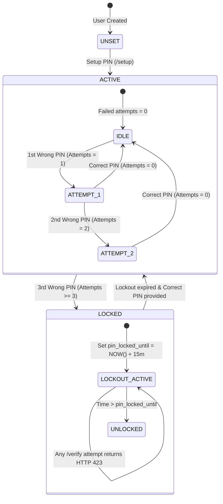

# Transaction PIN Security Specification (Sprint 2)

**Version:** 1.0.0  
**Status:** Implemented & Verified  
**Component:** B-Wallet Transaction Security & PIN Verification Subsystem  
**Compliance Standard:** OWASP Password Storage Guidelines / PCI-DSS Level 4  

---

## 1. Threat Model & Security Objectives

A 6-digit numeric PIN possesses an entropy space of $10^6$ ($1,000,000$) possibilities. In an unthrottled or weakly hashed environment, a GPU/ASIC cluster can brute-force the entire keyspace in under a second.

The B-Wallet PIN security engine mitigates this through a dual-defense architecture:

1. **Memory-Hard Cryptographic Hashing (Argon2id):** Elevates the per-guess computational and memory cost to prevent offline brute-force attacks even if the database is compromised.
2. **Stateful Lockout Policy (3-Attempt Threshold):** Terminates online guessing attacks by enforcing a 15-minute lockout after 3 consecutive failed attempts ($3 / 1,000,000 = 0.0003\%$ chance of guessing).

---

## 2. Cryptographic Parameters & Hashing Architecture

### 2.1 Algorithm Selection: Argon2id
Argon2id combines the data-dependent memory access of Argon2d (resistant to GPU cracking) and the data-independent memory access of Argon2i (resistant to side-channel cache-timing attacks), as recommended by the Password Hashing Competition (PHC) and OWASP.

| Parameter | Value | Rationale |
|---|---|---|
| **Algorithm** | `Argon2id` (v=19) | Hybrid defense against side-channel and GPU cracking |
| **Memory Cost (`m`)** | `65536` KB ($64$ MB) | Imposes heavy RAM footprint, making parallel ASIC/GPU attacks cost-prohibitive |
| **Time Cost (`t`)** | `3` iterations | Guarantees $\sim 150-250$ms verification latency, defeating high-frequency guessing |
| **Parallelism (`p`)** | `4` threads | Utilizes multi-core architecture |
| **Salt Length** | `16` bytes ($128$ bits) | Cryptographically secure random bytes via `crypto.randomBytes(16)` |
| **Hash Length** | `32` bytes ($256$ bits) | Standard SHA-256 equivalent digest length |

### 2.2 Hash Output Format
Stored in `public.profiles.pin_hash`:
```
$argon2id$v=19$m=65536,p=4,t=3$<base64-salt>$<base64-digest>
```

---

## 3. Lockout Policy & State Machine



### 3.1 Lockout Rules
1. **Initial State:** `pin_failed_attempts = 0`, `pin_locked_until = NULL`.
2. **Failed Attempt 1:** `pin_failed_attempts = 1`, API returns HTTP 400 with `remainingAttempts: 2`.
3. **Failed Attempt 2:** `pin_failed_attempts = 2`, API returns HTTP 400 with `remainingAttempts: 1`.
4. **Failed Attempt 3:** 
   - `pin_failed_attempts = 3`
   - `pin_locked_until = NOW() + INTERVAL '15 minutes'`
   - API returns **HTTP 423 (Locked)** with `code: 'PIN_LOCKED'`, `retryAfterSeconds: 900`, and `lockedUntil`.
5. **During Lockout:**
   - Any verification attempt (even with the correct PIN) immediately returns HTTP 423 with the exact seconds remaining.
6. **Successful Verification:**
   - `pin_failed_attempts` is immediately reset to 0.
   - `pin_locked_until` is cleared to NULL.
   - A short-lived **Transaction Authorization Ticket** is issued.

---

## 4. Transaction Authorization Tickets

To prevent the mobile client from repeatedly sending the plaintext PIN with every financial action (P2P transfer, top-up, bill payment), the server uses a tokenized authorization ticket model:

1. Client sends PIN to `POST /api/v1/auth/pin/verify`.
2. Upon successful verification, server returns:
   ```json
   {
     "success": true,
     "message": "PIN verified successfully",
     "data": {
       "authorized": true,
       "ticket": "<base64-payload>.<hmac-sha256-signature>",
       "expiresInSeconds": 300
     }
   }
   ```
3. **Ticket Structure:**
   - Payload: `{ "userId": "...", "purpose": "TRANSACTION", "authorizedAt": 1789214000, "expiresAt": 1789214300 }`
   - Signature: `HMAC-SHA256(payload, SUPABASE_SERVICE_ROLE_KEY)`
4. **Validity Window:** Exactly **5 minutes** (300 seconds).
5. Downstream endpoints in Sprint 4 (`/transfer`) and Sprint 5 (`/requests/pay`) require this ticket in the `X-Transaction-Ticket` header or request body.

---

## 5. Defense-in-Depth & Zero-Exposure Rules

1. **Database Tier:**
   - Column `public.profiles.pin_hash` is protected by Row Level Security (RLS).
   - Atomic database procedure `public.record_pin_attempt()` eliminates race conditions.
2. **Application Tier:**
   - Helper `sanitizeProfile()` strips `pin_hash` from all profile objects before serialization.
   - Express logging (Pino) actively redacts `pin`, `confirmPin`, `currentPin`, `newPin`, and `pin_hash`.
3. **Transport Tier:**
   - Enforced TLS 1.3 encryption across all client-server communications.
